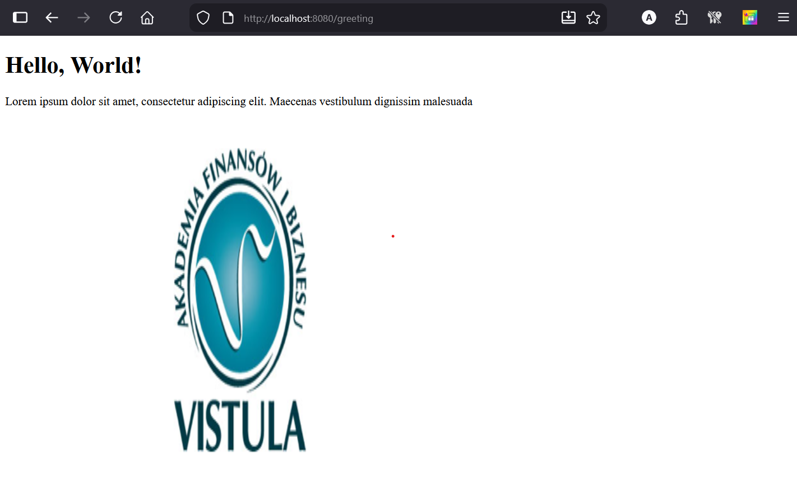

# Task 1 — Spring Boot (Browser endpoints)

This repository contains **Task 1** Spring Boot application 

---

## Requirements

- Java 17+ (recommended)
- Maven (or use the included Maven Wrapper)

---

## How to run

### Option A — IntelliJ IDEA
1. Open the project in IntelliJ.
2. Run the main class (the one annotated with `@SpringBootApplication`), e.g. `Task1ProjectJavaSpringApplication` / `Task1Application` (depending on your package).
3. Open your browser:
   - `http://localhost:8080/`
   - `http://localhost:8080/greeting`

### Option B — Terminal (Maven Wrapper)
From the project root:

```bash
# Windows
mvnw.cmd spring-boot:run

# macOS / Linux
./mvnw spring-boot:run
```

Then open:
- `http://localhost:8080/`
- `http://localhost:8080/greeting`

---

## Endpoints

### `GET /`
Returns a simple text message in the browser.

### `GET /greeting`
Returns a HTML page in the browser (includes a greeting text and an image).

---

## Screenshots (browser use cases)

> 

- Root endpoint (`/`):
 

- Greeting page (`/greeting`):
- 



```md
### GET /


### GET /greeting

```

---

## Project structure

```text
task1-project-java-spring/
├─ .idea/
├─ .mvn/
├─ wrapper/
├─ Screenshots/
├─ src/
│  ├─ main/
│  │  ├─ java/
│  │  │  └─ pl/edu/vistula/task1project.../
│  │  │     └─ (controllers + main application class)
│  │  └─ resources/
│  └─ test/
│     └─ java/
├─ pom.xml
├─ mvnw
└─ mvnw.cmd
```

---

## Notes

- If `http://localhost:8080/` shows a **Whitelabel Error Page (404)**, it means there is **no controller mapping for `/`**.
  - Your project now works correctly because you have a controller mapped to `/` and another mapped to `/greeting`.
